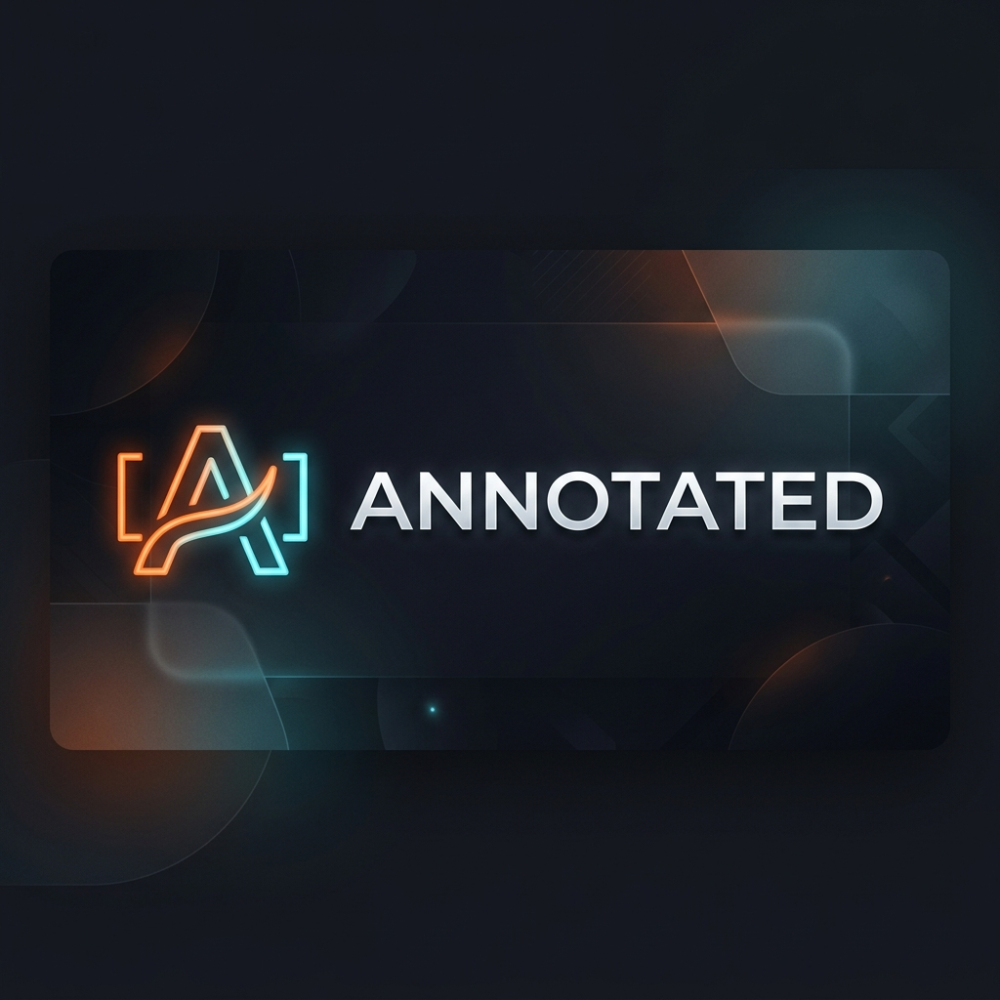

# Annotated.com — Media Clipping & Commentary Engine

> **A full-stack React 19 Chrome Extension + DBOS-powered backend for the Jason Calacanis $5,000 bounty.**

Clip any media from the web. Add commentary (text or voice). Remix content. Share annotated clips with a social community feed — all seamlessly integrated into a Chrome sidebar.

---

## 🌟 Key Features

- **Universal Server Extraction:** Powered by `yt-dlp`, paste URLs to automatically clip YouTube videos, Twitch VODs, Twitch Clips, and even Twitch Live Streams. For articles, highlight web text to capture semantic excerpts instantly.
- **Social Engagement Layer:** Public feeds with infinite scroll, user profiles, following, voting, and threaded comments.
- **X (Twitter) Native Integration & Profile Sync:** Seamlessly log in via X. Your X profile (username, display name, and avatar) is automatically synchronized to instantly provision your creator identity. Shared clips also generate dynamic Twitter Cards with rich media previews and deep-links back to your content.
- **High-Fidelity Audio Remixing:** Seamlessly mix extracted video with voiceovers and file uploads using FFmpeg volume ducking to ensure professional-grade production quality.
- **Crash-Safe Media Processing:** Long-running FFmpeg tasks are wrapped in DBOS Workflows, ensuring that if the server crashes mid-render, the clip generation resumes automatically upon reboot.
- **Continuous Threaded Annotations:** Specifically designed for articles and long-form text. Rapidly highlight multiple 100-word excerpts and chain them into a continuous thread—all without ever leaving the active tab.

---

## 🚀 Bounty Checklist: 8/8 Complete

| # | Requirement | Status | Implementation |
|---|-------------|--------|----------------|
| 1 | Max clip size: 90 seconds | ✅ | Hard limit enforced in API + `processClipWorkflow` |
| 2 | Video downgraded to 240p | ✅ | Handled server-side via `ffmpeg -vf scale=-2:240` |
| 3 | Link back to original source | ✅ | Native "View Original Source" button on Annotation Pages |
| 4 | "File a claim" button | ✅ | High-contrast `btn-danger` claim reporting mechanism |
| 5 | Account creation via X or Google | ✅ | Secure OAuth 2.0 integration via `google-auth-library` and `twitter-api-v2` |
| 6 | Public social feed | ✅ | Paginated `/feed` with full follow + comment + vote systems |
| 7 | Commentary (Text + Audio) | ✅ | Multi-modal: Textarea + mic toggle + direct audio file upload |
| 8 | Chrome sidebar extension | ✅ | Manifest V3 `sidePanel` with automatic active-tab URL detection |

---

## 🏗️ Architecture Overview

```
┌───────────────────────────────────────────────────────────┐
│  Chrome Browser                                           │
│  ┌──────────────┐     ┌────────────────────────────────┐  │
│  │  Active Tab   │◄───►│  Sidebar Extension (React 19)  │  │
│  └──────────────┘     └──────────┬─────────────────────┘  │
│                                  │                         │
│  ┌────────────────────────────────────────────────────────┐│
│  │  Landing Page SPA: Feed / Annotation Player / Social   ││
│  └────────────────────────────────────────────────────────┘│
└──────────────────────────┬────────────────────────────────┘
                           │ REST API
┌──────────────────────────▼────────────────────────────────┐
│  DBOS + Express Backend                                   │
│  ┌──────────┐  ┌───────────────┐  ┌───────────────────┐  │
│  │  OAuth    │  │  @workflow    │  │  yt-dlp + ffmpeg  │  │
│  │  Handlers │  │  Orchestrator │──►│  Media Pipeline   │  │
│  └──────────┘  └───────┬───────┘  └───────────────────┘  │
│                        │                                   │
│                 ┌──────▼──────┐                            │
│                 │ PostgreSQL  │                            │
│                 │     15      │                            │
│                 └─────────────┘                            │
└───────────────────────────────────────────────────────────┘
```

---

## 💡 Engineering Highlights

### Why DBOS?
Media processing via `ffmpeg` can fail mid-execution due to network timeouts, hardware constraints, or unexpected server reboots. By wrapping the pipeline in a `@DBOS.workflow()`, the execution state is persisted to DBOS's internal system tables. If the server crashes during a 90-second trim, the workflow **automatically resumes on reboot** — preventing zombie files, orphaned database rows, and lost user clips.

### Security Posture
- **Zero Shell Injection:** `child_process.execFile` is strictly enforced with array arguments (never raw `exec`).
- **Strict Authentication:** State-mutating endpoints enforce `auth.requireAuth` middleware, immediately rejecting unauthorized requests and neutralizing anonymous DoS attacks targeting the heavy FFmpeg pipeline.
- **Cross-Site Scripting (XSS):** All user content is explicitly HTML-escaped (`escapeHtml`) in server-rendered share pages.
- **Secure Sessions:** Token-based authentication utilizing HttpOnly, Secure JWT cookies.

### MCP (AI Agent Interface)
The backend simultaneously runs a **Model Context Protocol (MCP)** server over SSE and Stdio, allowing AI agents (like Claude) to call the `clip_media`, `add_comment`, and `vote_clip` tools natively to interact with the platform.

---

## 💻 Install the Extension

1. Download or clone this repo
2. Open `chrome://extensions` in Google Chrome
3. Enable **Developer Mode** (top right toggle)
4. Click **Load Unpacked** and select the `extension` folder
5. Pin the **Annotated** extension to your toolbar
6. Click the icon to open the side panel — it auto-detects your active tab

---

<p align="center">
  <i>Share beautifully across the web</i><br>
  
</p>

